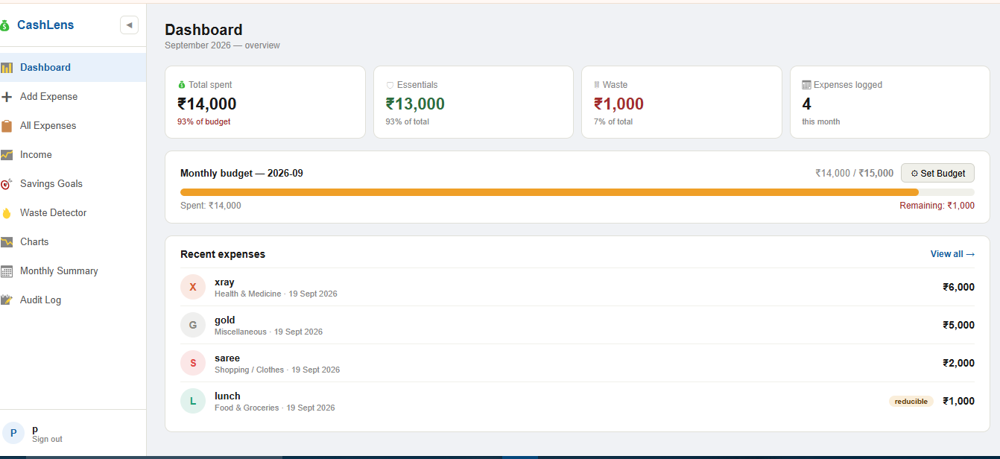

# 💰 CashLens — Backend API

Node.js + Express REST API for the CashLens personal expense tracker.

🔗
🔗 **Frontend Repo:** [github.com/prasthuthi8/cashlens](https://github.com/prasthuthi8/cashlens)
🔗 **Live API:** [cashlens-api.onrender.com](https://cashlens-api.onrender.com)
🔗 **Live App:** [cashlens-seven.vercel.app](https://cashlens-seven.vercel.app)

---

## 🛠️ Tech Stack

- **Node.js** + **Express.js** — REST API server
- **MySQL 8.0** — Relational database
- **mysql2** — MySQL driver for Node.js
- **jsonwebtoken** — JWT-based authentication
- **bcryptjs** — Password hashing
- **nodemailer** — Email OTP delivery via Gmail
- **dotenv** — Environment variable management
- Deployed on **Render** (backend) + **Railway** (MySQL)

---

## 📡 API Routes

### Auth
| Method | Route | Description |
|---|---|---|
| POST | `/auth/send-otp` | Send OTP to email for verification |
| POST | `/auth/verify-otp` | Verify OTP entered by user |
| POST | `/auth/register` | Register new user account |
| POST | `/auth/login` | Login and receive JWT token |

### Expenses (requires JWT)
| Method | Route | Description |
|---|---|---|
| GET | `/expenses` | Get all expenses for logged-in user |
| GET | `/expenses?month=2026-09` | Filter by month |
| POST | `/expenses` | Add new expense + budget check |
| DELETE | `/expenses/:id` | Delete an expense |

### Budget (requires JWT)
| Method | Route | Description |
|---|---|---|
| GET | `/budget/:month` | Get budget for a specific month |
| POST | `/budget` | Set or update monthly budget |

### Reports (requires JWT)
| Method | Route | Description |
|---|---|---|
| GET | `/summary` | Monthly summary (auto by triggers) |
| GET | `/waste` | Unnecessary + reducible expenses |
| GET | `/audit` | Audit log of high-value + deleted |
| GET | `/alerts` | Budget exceeded history |

### Income (requires JWT)
| Method | Route | Description |
|---|---|---|
| GET | `/income` | Get all income entries |
| POST | `/income` | Add income entry |
| DELETE | `/income/:id` | Delete income entry |

### Savings Goals (requires JWT)
| Method | Route | Description |
|---|---|---|
| GET | `/goals` | Get all savings goals |
| POST | `/goals` | Add new savings goal |
| PATCH | `/goals/:id` | Update saved amount |
| DELETE | `/goals/:id` | Delete a goal |

---

## 🗄️ Database Design

Run `database.sql` to create all tables and triggers.

### Tables
```
users           ← user accounts (hashed passwords)
categories      ← 12 expense categories (pre-seeded)
expenses        ← expense records (FK → users, categories)
budget          ← monthly budget per user (FK → users)
monthly_summary ← auto-updated by triggers
budget_alerts   ← budget exceeded events
expense_audit_log ← auto-updated by triggers
```

### Triggers
```
after_expense_insert
  → updates monthly_summary per user per month
  → logs expenses above ₹5,000 to audit log

after_expense_delete
  → subtracts from monthly_summary
  → logs deletion to audit log
```

### Constraints
```
CHECK (amount > 0)
CHECK (is_needed IN ('yes', 'no', 'maybe'))
CHECK (monthly_limit > 0)
FOREIGN KEY ... ON DELETE CASCADE
FOREIGN KEY ... ON UPDATE CASCADE
UNIQUE KEY uk_month_user (month_year, user_id)
```

---

## ⚙️ Local Setup

### 1. Clone and install
```bash
git clone https://github.com/YOUR_USERNAME/cashlens-backend
cd cashlens-backend
npm install
```

### 2. Set up MySQL database
Open MySQL Workbench and run `database.sql` — this creates all tables, seeds categories, and creates triggers.

### 3. Create `.env` file
```env
DB_HOST=localhost
DB_PORT=3306
DB_USER=root
DB_PASSWORD=your_mysql_password
DB_NAME=personal_expense_tracker
JWT_SECRET=cashlens_secret_key_2025
RESEND_API_KEY=your_resend_api_key
```
**Resend Email setup:**

1. Go to https://resend.com and create a free developer account.
2. Generate an API Key under the "API Keys" section.
3. Add that key to your Render Environment tab as `RESEND_API_KEY`.


### 4. Start server
```bash
node server.js
```
Server runs at `http://localhost:3000`

---

## 🚀 Deployment on Render

1. Push this repo to GitHub
2. Go to render.com → New Web Service → connect repo
3. Set:
   - Build command: `npm install`
   - Start command: `node server.js`
4. Add environment variables (same as `.env` above but with Railway DB details)
5. Deploy

Render auto-deploys on every GitHub push.

---

## 🌐 Environment Variables (Production)

```env
DB_HOST=railway_host
DB_PORT=railway_port
DB_USER=railway_user
DB_PASSWORD=railway_password
DB_NAME=railway
JWT_SECRET=your_strong_secret_key
RESEND_API_KEY=your_resend_api_key
PORT=3000
```

---

## 📄 License

MIT — free to use for learning and portfolio purposes.
